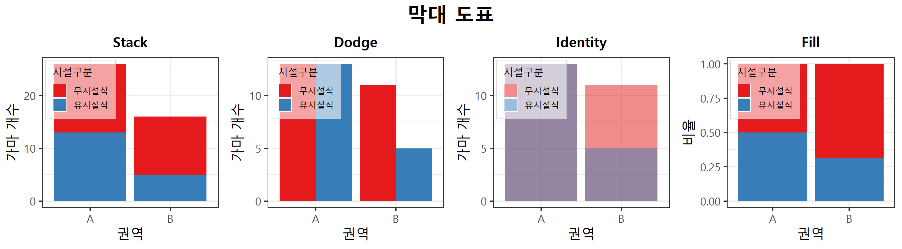
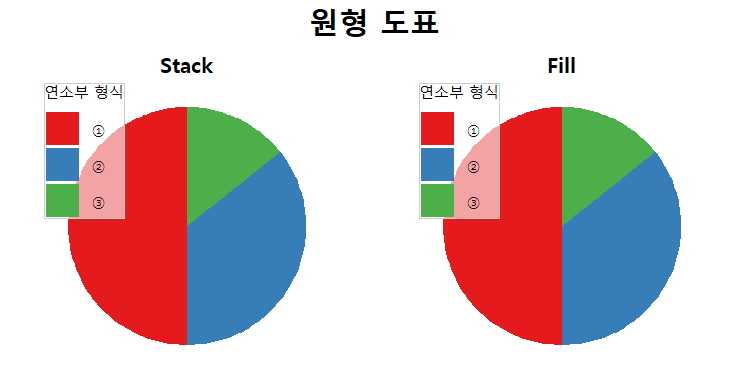
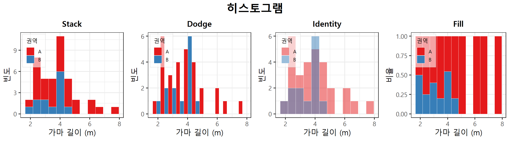
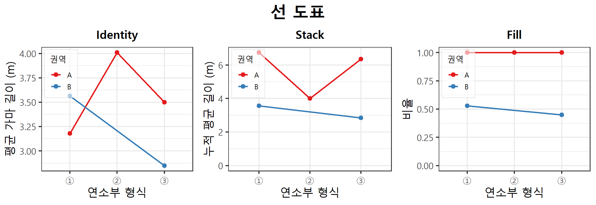
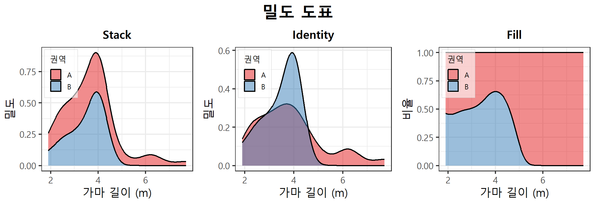
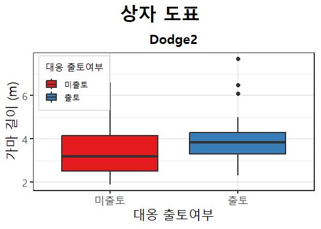
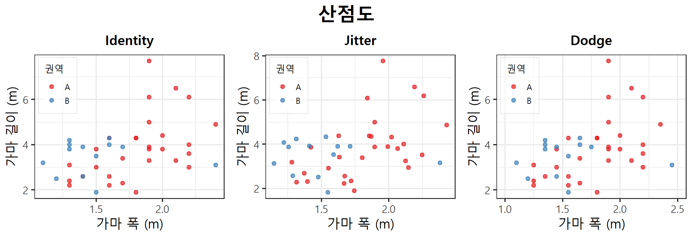
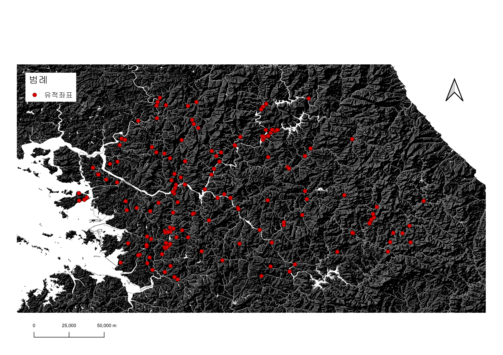

# AI 코딩을 활용한 고고학 자료 분석 실습

> 본 레포지토리는 2026년 7월 15일 부산대학교 고고학과 4단계 BK21 동아시아 SAP 융합 인재 양성사업단 특강 **AI 코딩을 활용한 고고학 자료 분석 실습**의 강의자료를 정리해둔 레포지토리입니다.
> 
> 본 강의는 `AI Agent`를 활용하여 고고학 자료를 분석해 보는 것을 목적으로 합니다. 이를 위해 개발환경을 직접 구성하고, 효율적인 프로젝트 구조화 및 관리 체계를 구축한 뒤, 탐색적 데이터 분석을 실시해 볼 예정입니다. 이러한 일련의 실습 과정을 통해 프로그래밍 언어에 얽매이지 않고 고고학 자료에 대한 분석을 통해 고고학적 맥락을 효율적으로 짚어내는 능력을 함양하고자 합니다.
> 
> 그럼에도 불구하고 **고고학**, **통계학**, **프로그래밍**에 대한 학습은 여전히 필수적입니다. AI가 아무리 빠르고 훌륭하게 코드를 작성하고 데이터를 요약해 주더라도, 분석 결과의 타당성을 검증하고, 가설을 설정하고, 고고학적 맥락을 정확히 짚어내는 것은 온전히 연구자의 몫이기 때문입니다. `AI Agent`가 어떤 통계적 원리로 결과를 도출했는지 이해하고 코드가 작동하는 기본 논리를 파악할 수 있어야만 AI의 도출 결과에 맹목적으로 끌려가는 위험을 방지할 수 있습니다. 결국 `AI Agent`는 우리의 작업 효율을 극대화해 주는 강력한 **도구**일 뿐이며, 올바른 질문을 던지고 최종적인 해석하는 연구자 본연의 역할을 대체할 수는 없습니다.

----------

## 1. 개발환경 구성

이 강의를 진행하기 위해서는 아래와 같은 준비물이 필요하니 참고 부탁드립니다.

```
1. 개인 노트북
2. AI 서비스 유료 구독
    - Claude: Pro (월 17$) 이상
    - Gemini: Pro (월 29,000원) 이상, Free는 제한적으로 사용 가능
    - Chat-gpt: Plus (월 29,000원) 이상, Free와 Go Plan은 제한적으로 사용 가능
```

### 1.1. R

#### 소개


R은 데이터 분석 및 통계분석에 특화된 오픈소스 프로그래밍 언어입니다. University of Auckland의 Ross Ihaka와 Robert Gentleman에 의해 개발되었으며, 데이터 처리와 시각화에 특화되어 있습니다. 통계분석과 관련된 수많은 패키지들이 구현되어 있으며, 고고학 분석에 활용되는 패키지들도 대부분 R로 구현되어 있습니다.

#### 설치

1. CRAN 접속: https://cran.r-project.org/ 에 접속합니다.
2. 운영체제 선택: 화면 상단의 `Download R for (운영체제)` 링크를 클릭합니다.
3. 설치 파일 다운로드:
   1. MacOS: 자신의 프로세서에 맞는 버전을 선택합니다.
       - Apple Silicon (M1, M2, M3 등): `arm64.pkg` 선택
       - Intel: `x86.pkg` 선택
   2. Windows: base를 클릭한 후, 화면 최상단의 `Download R-X.X.X for Windows`를 클릭합니다.
4. 설치 진행: 다운로드된 설치 파일을 실행하여 기본 설정 그대로 설치를 완료합니다.

### 1.2. IDE

#### 소개


통합개발환경(Integrated Development Environment, IDE)는 코드를 작성, 편집, 컴파일 및 디버그할 수 있는 소프트웨어입니다. 이를 통해 편리하게 코드 작성하고 프로젝트를 직관적으로 관리할 수 있습니다. 대표적인 IDE로는 Microsoft의 `VScode`, `Visual Studio` / Jetbrains의 `IntelliJ IDEA`, `Pycharms` Apple의 `Xcode` 등이 있습니다.

#### VScode 설치
본 강의에서는 가장 범용적으로 사용되는 IDE인 VSCode를 활용합니다. Microsoft에서 개발하고 배포하는 VScode는 (1)무료, (2)대부분의 운영체제에서 서비스, (3)필요로 하는 컴퓨팅 자원이 적음, (4)수많은 확장기능(Extension) 등의 장점이 있습니다. 아래의 절차에 따라 VScode를 설치해주세요.
1. 공식 홈페이지 접속: https://code.visualstudio.com/ 에 접속합니다.
2. 설치 파일 다운로드: 메인 화면의 파란색 `Download for (운영체제)` 버튼을 클릭합니다.
3. 설치 진행: 다운로드된 Setup 파일을 실행하여 설치를 완료합니다.

#### VScode Extension 설치
VScode는 컴파일러를 내장하고 있는 것이 아니기 때문에 사용하는 언어에 따라 컴파일러를 설치해주어야합니다. 우리는 앞서 R을 설치하였기 때문에 이를 VScode와 연결해주는 Extension을 추가로 설치하면 됩니다. 이외에도 Extension 형태로 여러 편의기능을 제공하고 있기 때문에 이를 살펴볼 필요가 있습니다. Extension을 설치하는 방법과 목록은 아래를 참고해주세요.

##### 설치방법

1. Extension 열기
   - MacOS: `Command(⌘)` + `Shift` + `X`
   - Windows: `Ctrl` + `Shift` + `X`
2. 필요한 기능 검색
3. 설치 클릭

##### 필수
- `R`: VScode 내에서 R 코드를 직접 실행할 수 있도록 지원

##### 선택
- `Code Spell Checker`: 변수명이나 주석의 오탈자를 체크하여, 가독성을 높여줌
- `Korean Language Pack for Visual Studio Code`: VScode의 모든 메뉴를 한국어로 변경
- `Material Icon Theme`: 직관적이고 깔끔한 아이콘으로 변경
- `Prettier - Code formatter`: 들여쓰기나 줄바꿈 등을 일관되고 깔끔하게 자동 정리해 줌
- `Spreadsheet Viewer`: .csv, .xlsx 파일을 외부 VScode 내에서 보여줌

### 1.3. AI Agent

#### 소개


`AI Agent`는 주어진 목표를 달성하기 위해 스스로 환경을 인지하고 계획을 세워 직접 작업을 수행하는 인공지능 시스템입니다. 다양한 작업이 가능하나, 가장 활발하게 응용되고 있는 분야가 코딩입니다. 최근 개발에 활용되는 `AI Agent`는 사용자를 대신해 파일 시스템을 제어하거나 직접적인 코딩을 수행합니다. 그리고 이러한 복잡한 작업 과정과 결과물을 사용자에게 효과적으로 전달하기 위해 TUI(Text/Terminal User Interface) 형태로 제공되는 것이 특징입니다.

코딩 작업에서 일반적인 LLM 대신 Agent를 활용하는 이유는 **맥락의 이해**과 **직접적인 실행 능력** 때문입니다. 일반적인 챗봇 형태의 LLM을 활용하는 작업이 단편적인 코드를 생성하는 것에 그친다면, 에이전트는 직접적인 수행 권한을 부여받아 프로젝트의 전반적인 구조를 이해하고 결과물을 직접적으로 생성하며, 에러가 발생할 경우 스스로 로그를 분석해 해결책을 적용합니다.

***TUI: 텍스트 문자와 키보드 입력만으로 컴퓨터 프로그램과 상호작용하는 화면 환경. AI 에이전트의 추론 과정이나 시스템의 실행 상태를 직관적으로 이해하는 것에 용이**

#### 설치

`AI Agent`는 터미널 환경을 통해 간단히 설치할 수 있습니다. 운영체제별 터미널 접속 방법은 아래를 참고해주세요.

- MacOS & Linux: `Command(⌘)` + `Spacebar` 누르기 → 터미널(Terminal) 검색 후 실행
- Windows: `Win(⊞)` + `X` 누르기 → 터미널(관리자) 클릭

터미널을 실행하셨다면 본인이 현재 구독하고 있는 유료 AI 서비스에 따라서 `AI Agent` 설치를 진행해주세요. 각 제품별 설치 명령어는 아래와 같습니다.

#### Claude Code (Anthropic)

##### - MacOS & Linux
Mac 또는 Linux에서 `Claude Code`를 설치하려면 아래의 명령을 실행하세요.
``` bash
curl -fsSL https://claude.ai/install.sh | bash
```

##### - Windows
Windows에서 `Claude Code`를 설치하려면 아래의 명령을 실행하세요.
``` powershell 
irm https://claude.ai/install.ps1 | iex
```
#### Antigravity CLI (Google)
*기존에는 `Gemini CLI`가 있었으나, 2026년 6월 18일에 서비스가 종료되었고 `Antigravity CLI`로 일원화 되었습니다.
##### - MacOS & Linux
Mac 또는 Linux에서 `Antigravity CLI`를 설치하려면 아래의 명령을 실행하세요.
``` bash
curl -fsSL https://antigravity.google/cli/install.sh | bash
```

##### - Windows
Windows에서 Antigravity CLI를 설치하려면 아래의 명령을 실행하세요.
``` powershell 
irm https://antigravity.google/cli/install.ps1 | iex
```

#### Codex CLI (OpenAI)
##### - MacOS & Linux
Mac 또는 Linux에서 `Codex CLI`를 설치하려면 아래의 명령을 실행하세요.
``` bash
curl -fsSL https://chatgpt.com/codex/install.sh | sh
```

##### - Windows
Windows에서 `Codex CLI`를 설치하려면 아래의 명령을 실행하세요.
``` powershell 
powershell -ExecutionPolicy ByPass -c "irm https://chatgpt.com/codex/install.ps1 | iex"
```

----------

## 2. 탐색적 데이터 분석(Exploratory Data Analysis, EDA)
**탐색적 데이터 분석**은 데이터의 전반적인 구조와 특징을 파악하기 위해 다각도로 접근하는 분석 방법입니다. 존 튜키(John Tukey)에 의해 제안된 개념으로 데이터를 있는 그대로 관찰하면서 숨겨진 패턴을 발견하고, 데이터의 분포를 확인하며, 이상치를 찾아내는 모든 과정을 포괄합니다.

| 구분 | 확증적 데이터 분석 (CDA) | 탐색적 데이터 분석 (EDA) |
| :--- | :--- | :--- |
| **목적** | 가설 검증 | 데이터의 패턴 발견 |
| **접근 방식** | 가설 설정 후 데이터로 평가 | 데이터 관찰 및 탐색 |

고전 통계(확증적 데이터 분석, Confirmatory Data Analysis, CDA)의 경우, 미리 설정한 가설이 통계적으로 유의미한지 확인하는 **검증**이라면, EDA는 선입견 없이 데이터 그 자체의 생김새를 살피며 숨겨진 패턴을 찾아내는 **질문**에 가깝습니다. 고전 통계학은 데이터가 특정 확률 분포(예: 정규분포)를 따른다는 전제를 두고 평균, 표준편차, p-value 등과 같은 지표에 의존하지만, EDA는 데이터의 전체적인 분포를 시각화하여 놓치기 쉬운 이상치나 비선형적 양상을 포착하는 것에 집중합니다. 

이러한 EDA는 데이터에 대한 올바른 질문을 던지기 위해 반드시 필요합니다. 원시 데이터(Raw Data)는 결측치나 오류를 포함하고 있는 경우가 많아, 이를 그대로 분석에 사용하면 왜곡된 결과를 초래하는 문제가 발생합니다. 사전에 데이터를 시각화하고 기초 통계량을 확인하는 과정을 통해 데이터의 결함이나 예상치 못한 변수 간의 관계를 발견할 수 있으며, 이는 이후 진행될 본격적인 분석의 정확도를 높여줍니다.

| 수치형 데이터(Numerical Data) | 범주형 데이터(Categorical Data) |
| :--- | :--- |
| 연속형(Continuous Data)<br>예시: 유물/유구의 제원, 탄소연대측정치 등 | 명목형(Nominal Data)<br>예시: 기종, 재질, 출토 유구 등 |
| 이산형(Discrete Data)<br>예시: 특정 유구에서의 출토량 등 | 순서형(Ordinal Data)<br>예시: 시기, 단계, 형식 등 |

특히 고고학 분야에서 EDA의 중요성은 더욱 강조됩니다. 고고학 자료는 유물의 재질, 형태, 색상 같은 범주형 데이터부터 제원, 방사성탄소연대측정치와 같은 연속형 데이터, 그리고 유구의 위치를 나타내는 공간 데이터까지 그 성격이 엄청나게 다양합니다. 게다가 최근 지속적인 발굴조사가 누적되면서 분석해야 할 자료의 수는 기하급수적으로 늘어나고 있습니다. 또한 완전한 자료가 많지 않기에 결측치가 빈번하고, 현장 자체가 복잡한 맥락을 가지기에 EDA를 통해 데이터의 경향을 파악하고 과정은 고고학 연구에 많은 도움이 됩니다.

EDA의 절차는 데이터 수집, 데이터 전처리, 기초통계량 확인 및 시각화의 흐름으로 진행됩니다. 먼저 흩어져 있는 발굴 조사 보고서나 측정 결과지에서 분석 목적에 맞는 데이터를 수집하여 병합합니다. 이후 전처리 단계에서는 데이터의 일관성을 맞추기 위해 변수명을 정리하고, 필요한 자료들을 필터링합니다. 그리고 이상치나 결측치를 어떻게 처리할지 결정합니다. 그리고 기초 통계량 및 시각화를 활용하여 데이터의 분포와 변수 간의 상관관계 등을 파악하는 과정으로 이루어집니다.

----------

## 3. 프로젝트 관리


### 3.1. 프로젝트 구조화의 중요성
프로젝트 구조화는 단순히 파일을 보기 좋게 정돈하는 것을 넘어, `AI Agent`를 활용하기 위한 필수적인 토대입니다. 일반적인 챗봇 형태의 AI 서비스가 채팅창에 입력된 단편적인 내용만을 가지고 작업을 수행하는 것과 달리, `AI Agent`는 프로젝트 전체를 탐색하며 작업의 전체적인 맥락을 파악하고 이를 바탕으로 작업을 수행합니다.

따라서 복잡한 작업일수록 파일명과 디렉토리 구조 자체가 `AI Agent`에게 훌륭한 '가이드라인'이 됩니다. 구조가 체계적일수록 AI 에이전트는 불필요한 작업을 최소화하고 맥락에 부합하는 결과물을 산출할 수 있으며, 작업수행에 소요되는 시간을 획기적으로 단축할 수 있습니다.

### 3.2. 프로젝트 구조 설정

프로젝트를 구성하는 디렉토리 구조에 절대적인 정답은 없습니다. 다만 연구 목적과 데이터의 성격에 맞춰 일관성 있는 규칙을 정하는 것이 중요합니다. 필자의 경우 대체로 아래와 같이 네 가지 주요 폴더로 구분하여 관리하고 있습니다.

`Data/` : 분석을 위한 데이터를 보관하는 디렉토리입니다. 원본 데이터(Raw Data)와 전처리를 거친 데이터(Processing Data)를 분리해서 저장해야 합니다.

`Scripts/` : AI 에이전트가 작성하거나 연구자가 직접 구성한 코드 파일들을 모아두는 디렉토리입니다. 코드가 꼬이는 것을 방지하기 위해 01_데이터전처리.R, 02_기초통계.R, 03_시각화.R 처럼 작업의 실행 순서에 따라 직관적인 파일명을 부여하는 것이 좋습니다.

`Results/` : 스크립트를 실행하여 도출된 기초 통계 요약표, 각종 그래프, 생성한 이미지 등 산출물이 저장되는 공간입니다.

`References/` : 분석의 배경이 되는 발굴조사보고서, 관련 학술 논문 등을 보관합니다.

### 3.3. 온톨로지(Ontology)로의 확장

단순히 파일을 폴더별로 분류하는 수준을 넘어, 고도로 복잡해지는 고고학 자료를 AI를 활용하여 분석하기 위해서는 온톨로지(Ontology)의 개념으로 나아갈 필요가 있습니다.

온톨로지란 특정 분야에 대한 개체의 개념들을 명확히 정의하고, 그것들 사이의 관계를 컴퓨터가 이해할 수 있는 형태로 구조화하는 지식 표현 방식을 의미합니다. 온톨로지를 구축한다는 것은 단순히 자료를 정리하는 것에서 나아가, `AI Agent`가 **어떤 토기가, 어떤 유구 및 유적에서 수습되었고, 이것이 어떤 다른 유구 및 유적과 연관되며, 어떤 고고학적 의미를 갖는지**와 같은 맥락을 이해하는 것의 바탕이 됩니다.

이와 관련하여 구체적인 부분은 다음 시간의 강연자이신 김홍연, 조하영 두 선생님의 특강과 연구를 참고하면 좋을 것 같습니다.

[김홍연, 2025, 「대형 언어 모델(LLM)을 활용한 고고학 정보화 연구 - 발굴조사보고서의 메타데이터 자동 추출 파이프라인 개념 검증 -」, 『헤리티지: 역사와 과학』 58-3, 국립문화유산연구원.](https://doi.org/10.22755/kjchs.2025.58.3.34)

[조하영, 2025, 「해양문화유산 데이터 구조화에 대한 제언」, 『도서문화』 66, 국립목포대학교 도서문화연구원.](https://doi.org/10.22917/island.2025..66.271)

----------

## 4. 분석 실습

본격적인 분석 실습에 앞서, 우리가 해결하고자 하는 상황을 먼저 설정해 보겠습니다. 이번 실습에서 우리가 다루어야 하는 대상은 백제 한성기 중부지역의 토기가마입니다. 가마는 고고학적으로 확인할 수 있는 대표적인 생산시설로 경제체계나 기술 수준과 밀접한 관련이 있습니다. 과거에는 호남, 영남지역에 비해 조사사례가 많지 않았으나, 조사의 누적으로 양이 증가하였기에 이를 다루어보고자 합니다.

다행히 이와 관련하여 기존의 가마 제원과 출토 양상 데이터가 집성된 논문이 존재하며, 우리는 이 논문에 수록된 데이터를 활용할 예정입니다. 이제부터 `AI Agent`를 활용하여 해당 데이터에 대한 탐색적 데이터 분석(EDA)을 실시하고, 고고학적 의미를 찾아보는 실습을 진행해 보고자 합니다.

### 4.1. 프로젝트 생성
가장 먼저 연구 프로젝트 폴더를 생성하도록 하겠습니다. 아래의 절차를 참고해주세요.

1. 원하는 위치에 폴더 생성
2. 설정한 규칙에 따라 하위 폴더를 생성하고, 자료 등을 배치
3. VScode 실행
4. 파일 → 폴더 열기 → 프로젝트 폴더 선택

### 4.2. `AI Agent` 구동과 슬래시 명령어

지금까지 개발환경을 구성하고 프로젝트를 생성하였습니다. 이후 VScode 내에서 `AI Agent`를 실행해야하며, 구동 방법은 아래와 같습니다.

1. VScode 내에서 터미널 열기
    - 단축키: `Ctrl` + `Shift` + `` ` ``
    - GUI: 메뉴 → 터미널 → 새 터미널
2. 명령어를 입력하여 실행
    - Claude code
        ```bash
        claude
        ```
    - Antigravity CLI
        ```bash
        agy
        ```
    - Codex CLI
        ```bash
        codex
        ```

#### 슬래시 명령어?
`AI Agent`를 실행하였으니 이제 일을 시킬 차례입니다. 이때 유용하게 사용되는 것이 슬래시 명령어(Slash Commands)입니다. 슬래시 명령어는 `AI Agent` 자체를 제어하기 위해 사용하는 단축 명령어입니다. 프롬프트에서 명령어 앞에 슬래시(`/`)를 붙여 입력하면, AI는 이를 분석해야 할 자연어로 받아들이지 않고 즉각적인 시스템 동작으로 처리합니다. 이를 통해 우리는 복잡한 설정 메뉴를 찾을 필요 없이 타이핑만으로 빠르게 작업을 지시할 수 있습니다.

**주요 슬래시 명령어 정리**

| 기능 | Claude Code | Antigravity CLI | Codex CLI |
| :--- | :--- | :--- | :--- |
| 프로젝트 환경 초기화 | `/init` | -자동- | `/init` |
| 모델 변경 | `/model` | `/model` | `/model` |
| 토큰 사용량 및 비용 확인 | `/usage` | `/usage` | `/usage` |
| 현재 화면 및 대화 기록 지우기 | `/clear` | `/clear` | `/clear` |
| 컨텍스트 사용량 확인 | `/context` | `/context` | `/context` |
| 컨텍스트 요약 및 압축 | `/compact` | ---- | `/compact` |
| 이전 대화로 이동 | `/rewind` | `/rewind` | ---- |
| 공식문서 | [Claude Docs 바로가기](https://code.claude.com/docs/ko/cli-reference) | [Antigravity Docs 바로가기](https://antigravity.google/docs/cli-using) | [Codex Docs 바로가기](https://developers.openai.com/codex/cli/slash-commands) |

### 4.3. `AGENTS.md` 작성

#### 소개
`AGENTS.md`는 `AI Agent`가 프로젝트 내에서 작업할 때 반드시 지켜야 할 행동 지침서입니다. 단순한 텍스트 파일처럼 보이지만, 프로젝트의 최상위 경로에 위치하며 `AI Agent`가 코드를 작성하거나 데이터를 분석할 때 항상 최우선으로 참고하는 나침반 역할을 합니다.

`AGENTS.md`를 작성해야 하는 가장 큰 이유는 AI의 작업 일관성을 유지하고 불필요한 작업을 줄이기 위해서입니다. 고고학 자료 분석은 고유한 용어와 특유의 분석 방법론이 빈번하게 사용하는데, 매번 프롬프트에 특정 변수명을 지정하거나, 특정 패키지를 사용하도록 지시하는 것은 매우 비효율적입니다. 따라서 `AGENTS.md`에 이러한 사항을 미리 명시해 두면, 연구자의 의도대로 결과물을 출력할 수 있습니다.

`AGENTS.md`를 작성하기 전, 터미널에서 `/init` 명령어를 실행하면 일차적으로 AI 에이전트 스스로 파일과 폴더를 스캔하여 프로젝트의 전반적인 구조를 파악하게 됩니다(Antigravity CLI 제외). 하지만 이러한 물리적인 파일 구조 스캔만으로는 연구자가 어떤 학문적 배경을 가지고 있으며, 구체적으로 어떤 규칙을 적용하여 코드를 작성하고 싶은지 등의 깊은 의도까지 이해할 수는 없습니다. 따라서 `/init`을 통해 기본적인 환경을 파악하게 한 뒤, 생성된 `AGENTS.md`에 논리적이고 학술적인 규칙을 부여하는 과정이 필수적입니다.

##### `Codex`가 `/init`으로 작성한 `AGENTS.md`
```
# Repository Guidelines

## 프로젝트 구조 및 모듈 구성

이 저장소는 데이터 기반 작업을 위한 구조입니다.

- `Data/`는 입력 데이터셋과 참고 자료를 보관합니다. 대용량 원본 데이터나 민감한 데이터는 명시적으로 필요하지 않다면 git에 포함하지 마세요.
- `Scripts/`는 분석, 전처리, 자동화 스크립트를 보관합니다. `clean_data.py`, `run_analysis.R`처럼 목적이 분명한 이름을 사용하세요.
- `Results/`는 생성된 결과물, 보고서, 그림, 중간 산출물을 보관합니다. 가능하면 이 디렉터리의 파일은 재현 가능한 결과로 관리하세요.

현재 별도의 패키지 매니페스트나 애플리케이션 소스 트리는 없습니다. 새 코드는 더 큰 구조가 필요해지기 전까지 `Scripts/` 아래에 추가하세요.

## 빌드, 테스트, 개발 명령

아직 프로젝트 전용 빌드 또는 테스트 명령은 정의되어 있지 않습니다. 스크립트는 사용하는 언어의 실행기로 직접 실행하세요.

python Scripts/example.py
Rscript Scripts/example.R

반복 가능한 워크플로를 추가한다면 `README.md`에 문서화하고, 가능하면 `make run`, `make test` 또는 작은 셸 스크립트처럼 단일 진입점을 제공하세요.

## 코딩 스타일 및 명명 규칙

파일명은 `prepare_dataset.py`처럼 소문자와 밑줄을 사용해 명확하게 작성하세요. 스크립트는 결정적으로 동작해야 하며, 입력은 `Data/`에서 읽고 출력은 `Results/`에 쓰는 방식을 권장합니다. 하드코딩된 절대 경로는 피하세요.

Python은 4칸 들여쓰기와 PEP 8 명명 규칙을 따르세요. R 코드는 일관된 공백, 설명적인 객체명, 숨겨진 전역 상태를 피하는 방식을 유지하세요. 주석은 명확하지 않은 로직을 설명할 때만 간결하게 작성하세요.

## 테스트 지침

아직 테스트 프레임워크는 설정되어 있지 않습니다. 재사용 가능한 로직을 추가할 때는 코드 근처 또는 향후 `tests/` 디렉터리에 집중된 테스트를 추가하세요. 테스트 파일명은 `test_clean_data_handles_missing_values.py`처럼 검증하는 동작을 드러내는 이름을 사용하세요.

커밋 전에는 관련 스크립트를 깨끗한 작업 상태에서 실행하고, 기대한 결과 파일이 `Results/`에 생성되는지 확인하세요.
```

위에서 확인되는 것처럼 `/init`를 통해 작성된 AGENTS.md 파일의 내용은 다소 부실합니다. 따라서 사용자의 목적에 따라서 이를 보강할 필요가 있습니다. `Agents.md`를 작성하는 것에 정답은 없지만, 효과적으로 작성하기 위해서는 몇 가지 규칙에 따라야 합니다.
   - 첫째, 사용할 도구와 '사용하지 말아야 할 도구'를 명시하여 불필요한 확장을 제한해야 합니다.
   - 둘째, 데이터 전처리 시 통일해야 할 고유 명사나 변수명 등의 세부 규칙을 구체적으로 포함해야 합니다. 
   - 셋째, 폴더 구조와 같은 작업 관례에 대해 정리해야합니다.
   - 넷쨰, 자명한 지시는 제외해야합니다. (예: 깔끔하게 작성하세요.)
   - 다섯째, 최대 200줄 이내로 작성해야합니다. 너무 길게 작성된 경우 `AI Agent`가 이를 무시하기도 합니다.

#### 직접 작성한 `AGENTS.md`

``` markdown
# 프로젝트 규칙 (Project Rules)

본 프로젝트는 `AI Agent`와 연구자가 협력하여 고고학 자료를 탐색적 데이터 분석(EDA)하는 프로젝트입니다. 작업 시 다음의 명시적인 규칙들을 반드시 준수해야 합니다.

## 1. 개발 언어 및 라이브러리 규칙
- **분석 도구**: 모든 데이터 전처리, 통계 분석, 시각화 작업에는 **`R`** 언어를 사용합니다. (Python 등 타 언어 사용 금지)
- **데이터 전처리_패키지**: 기본 명령어만 활용하세요 **`dplyr`**, **`tidyr`**, **`plyr`** 등은 사용하지 말고 기본 R 명령어를 사용하세요.
- **데이터 전처리_필터링**: `subset` 명령어를 우선적으로 사용하세요
- **데이터 전처리_저장**: 전처리가 완료된 파일은 저장하지말고, 스크립트 코드만 저장하세요.
- **시각화_패키지**: 데이터 시각화 시에는 **`ggplot2`** 패키지를 필수적으로 사용합니다.
- **분석_방사성탄소연대**: 방사성탄소연대측정치 분석을 수행할 때는 **`rcarbon`** 패키지를 사용합니다.

## 2. 프로젝트 디렉토리 구조 및 파일 명명 규칙
프로젝트의 일관성 및 맥락 파악을 위해 다음의 폴더 구조와 파일 관리 관례를 따릅니다.

- **`Data/`**: 분석용 데이터가 보관되는 공간입니다.
  - 원본 데이터(Raw Data)는 어떠한 경우에도 삭제하거나 변형하지마세요.
  - 문헌 등에서 추출한 개별 데이터 테이블의 경우 `저자명+연도+표번호.csv` 형식으로 명명하고, 파일 인코딩은 **`UTF-8`**로 설정합니다.
- **`Scripts/`**: 분석용 R 스크립트 파일을 모아두는 공간입니다.
  - 작업 및 분석의 실행 순서가 직관적으로 드러나도록 파일명 앞에 순차적인 일련번호를 부여합니다.
    - 예시: `01_데이터전처리.R`, `02_기초통계.R`, `03_시각화.R`
- **`Results/`**: 분석 결과 도출된 산출물이 저장되는 공간입니다.
  - 스크립트 실행으로 얻어진 요약 테이블, 통계 그래프, 시각화 이미지 등은 반드시 이 폴더 아래에 생성 및 저장합니다.
- **`References/`**: 연구 및 분석의 학술적 배경이 되는 보고서, 논문 등의 참고문헌 자료를 저장합니다.

```

### 4.4. 데이터 수집

분석 대상이 명확하게 설정되었다면, 본격적인 첫걸음은 바로 '데이터 수집'입니다. 데이터 분석 분야에는 **'쓰레기가 들어가면 쓰레기가 나온다(Garbage In, Garbage Out)'** 이라는 아주 유명한 격언이 있습니다. 아무리 훌륭한 기술과 기법을 사용하더라도, 분석의 뼈대가 되는 데이터 자체가 부실하다면 결코 의미 있는 결론에 도달할 수 없습니다. 따라서 연구 목적에 맞는 양질의 데이터를 정확하게 수집하는 과정은 전체 연구의 성패를 좌우하는 가장 중요한 기반 단계라고 할 수 있습니다.

고고학 연구에서 활용되는 데이터는 기본적으로 발굴조사보고서를 비롯해, 기존의 연구 논문이나, 특정 목적에 의해 작성된 자료집 등에서 얻게 됩니다. 이러한 자료들을 살펴보면, 유구의 규모나 유물의 제원, 재질, 출토맥락과 같은 속성들이 대개 특정 양식이나 표 형태로 일목요연하게 정리되어 있는 경우가 많습니다. 우리는 이처럼 여러 문헌에 흩어져 있는 표들을 하나로 모아 분석 가능한 형태의 데이터셋으로 병합하는 작업을 거치게 됩니다.

과거에는 수백 권의 보고서를 펼쳐놓고 표의 내용들을 엑셀에 일일이 타이핑하는 고강도 노동이 필수적이었습니다. 하지만 `AI Agent`를 활용하면 이러한 단순 반복 작업을 획기적으로 줄일 수 있습니다. 예를 들어, 규칙 없이 흩어진 여러 엑셀 파일을 하나의 파일로 병합하거나, 십 수개의 데이터셋을 한 번에 정제하는 등의 과정들을 `AI Agent`에게 위임함으로써 물리적인 작업 시간을 대폭 단축할 수 있습니다.

그러나 결코 간과하지 말아야 할 가장 중요한 사실이 있습니다. `AI Agent`를 통해 수천 줄의 데이터를 순식간에 간편하게 정리했다고 하더라도, 연구자는 반드시 최종 데이터셋을 직접 훑어보며 고고학적 맥락을 면밀히 점검해야 합니다. 표에 숫자로 기록된 제원 이면에 숨겨진 유구 간의 연관성은 무엇인지, 수습 과정에서의 파손으로 인해 잘못 기입된 결측치가 섞여 있지는 않은지 등은 오직 연구자의 비판적 시각을 통해서만 해석될 수 있기 때문입니다. 결국 AI는 흩어진 데이터를 효율적으로 정돈해 주는 훌륭한 도구일 뿐, 그 데이터에 생명력과 의미를 불어넣는 것은 연구자 본연의 몫입니다.

먼저 `References` 폴더에 있는 논문의 자료를 추출해보도록 하겠습니다. 아래의 프롬프트를 통해 논문 내에 집성된 자료를 `.csv` 파일로 출력해보겠습니다.

#### 예시 프롬프트
```
논문명.pdf의 <표 2>를 CSV 파일로 추출하세요.
모든 행과 열을 빠짐없이 포함하세요.
파일명은 저자명+연도+표2.csv로 하고, 포맷은 UTF=8로 저장하세요.
```

#### 실제 프롬프트
```
4.4.실습파일1.pdf의 표를 CSV 파일로 추출하세요.
- 모든 행과 열을 빠짐없이 포함하세요.
- 병합되어 있는 셀은 분할하여 내용을 그대로 기입하세요.
- 파일명은 원본파일명_내용.csv로 하세요.
- 포맷은 UTF=8로 저장하세요.
```

### 4.5. 데이터 전처리

데이터 수집이 완료되었다면, 이어서 데이터 전처리 과정을 거쳐야 합니다. 데이터 전처리란 수집한 원시 데이터(Raw Data)를 실제 분석 목적에 알맞은 형태로 가공하고 다듬는 모든 과정을 의미합니다. 현장에서 수집된 표나 데이터베이스는 빈칸이나 중복값이 혼재되어 있는 경우가 많기 때문에, 이를 그대로 분석에 투입하면 왜곡된 결과가 도출될 수 있습니다.

일반적으로 데이터 전처리에는 다음의 네 가지 핵심 요소가 포함됩니다.

- **데이터 정제 (Data Cleaning)**: 비어있는 결측치(NA)를 어떻게 처리할지 결정하고, 이상치(Outlier)를 식별하여 교정하거나 제거하는 작업입니다. 또한, 변수명의 오탈자를 일관되게 맞추는 등의 문자열 수정 작업도 여기에 속합니다.
- **데이터 통합 (Data Integration)**: 여러 데이터셋을 하나의 분석용 데이터셋으로 병합하는 과정입니다.
- **데이터 변환 (Data Transformation)**: 분석 기법에 맞게 데이터의 형태나 단위를 바꾸는 과정입니다. 연속형 데이터인 유물의 길이를 범주형(대/중/소)으로 묶거나, 표준화, 정규화하는 등의 작업이 해당합니다.
- **데이터 축소 (Data Reduction)**: 변수의 개수가 너무 방대할 때, 데이터의 고유한 특성을 보존하면서 분석의 효율성을 높이기 위해 규모를 줄이는 기법입니다. 주성분분석(PCA)과 같은 차원 축소를 통해 다중공선성을 해결하고 핵심적인 변수만 남기는 방식이 대표적입니다.

위의 기본 요소들과 더불어, 실전 고고학 데이터 분석에서 특히 강조하고 싶은 부분은 바로 **데이터 선택(Selection, 필터링)** 의 중요성입니다. 연구의 세부 목적에 따라 필요한 전처리 작업의 방향은 완전히 달라집니다. 전체 데이터셋 중에서 어떤 맥락의 데이터를 선택하느냐에 따라 최종 분석 결과와 해석이 결정됩니다.

이제 이러한 전처리 요소들을 염두에 두고, `AI Agent`를 활용하여 데이터를 전처리해보도록 하겠습니다. 아래의 프롬프트에 따라 데이터 전처리를 실행하여, 우리가 수집한 원시 데이터를 분석 가능한 형태로 처리해보세요.

#### 실제 프롬프트

``` Prompt
아래의 지시사항에 따라 4.4.실습파일1_중부지역 토기 가마의 구조 및 출토 유물.csv 파일에 대한 데이터 전처리를 실시하세요.
- 가마크기(m)_길이 혹은 가마크기(m)_폭의 값이 '?' or '-' or 괄호처리 or 빈칸인 경우는 제외해주세요.
- 재임이 '='이거나 '?'인 경우에는 '알 수 없음', '무시설식'인 경우에는 그대로, 이외는 '유시설식'으로 변환하세요.
- 권역별로 데이터를 분할하세요.
```

#### 결과물
아래와 같은 R Script 파일을 생성하였습니다. 각 작업마다 다르게 생성될 수 있으니 다르게 작성되었다고 해서 걱정하지마세요.
``` R
# 1. 데이터 불러오기
file_path <- "Data/4.4.실습파일1_중부지역토기가마의구조및출토유물.csv"
df <- read.csv(file_path, fileEncoding = "UTF-8", stringsAsFactors = FALSE)

# 2. 가마크기 필터링 함수 정의 및 적용
# 가마크기_길이 또는 가마크기_폭의 값이 '?', '-', 괄호 포함, 또는 빈칸인 행 제외
is_valid <- function(x) {
  !is.na(x) & x != "" & x != "?" & x != "-" & !grepl("(", x, fixed = TRUE) & !grepl(")", x, fixed = TRUE)
}

# subset 명령어를 우선적으로 사용하여 데이터 필터링
df_clean <- subset(df, is_valid(가마크기_길이) & is_valid(가마크기_폭))

# 가마크기 값을 수치형(Numeric)으로 변환
df_clean$가마크기_길이 <- as.numeric(df_clean$가마크기_길이)
df_clean$가마크기_폭 <- as.numeric(df_clean$가마크기_폭)

# 3. 재임방식 변환
# 재임방식이 '='이거나 '?'인 경우 '알 수 없음'으로 변환
# (실제 데이터의 '-' 및 빈값 ""도 결측치를 의미하므로 함께 '알 수 없음'으로 처리)
# '무시설식'은 그대로 유지, 그 외(할석, 할석+도침, 홈+할석, 홈내기식 등)는 '유시설식'으로 변환
df_clean$연소부_재임방식 <- ifelse(df_clean$연소부_재임방식 == "=" | 
                                 df_clean$연소부_재임방식 == "?" | 
                                 df_clean$연소부_재임방식 == "-" | 
                                 df_clean$연소부_재임방식 == "", "알 수 없음",
                               ifelse(df_clean$연소부_재임방식 == "무시설식", "무시설식", "유시설식"))

# 4. 권역별 데이터 분할
# split 함수를 사용하여 리스트 형태로 분할
df_split <- split(df_clean, df_clean$권역)

# 개별 데이터 프레임으로도 분할 저장
df_A <- subset(df_clean, 권역 == "A")
df_B <- subset(df_clean, 권역 == "B")
df_etc <- subset(df_clean, 권역 == "기타")
```

### 4.6. 기술 통계량

데이터 전처리를 했다면, 이제 데이터의 기초적인 정보를 확인해 볼 차례입니다. 기술통계량(Descriptive Statistics)이란 수집된 데이터가 가진 특징을 한눈에 파악할 수 있도록 요약해 주는 수치들을 의미합니다. 고고학 자료를 예로 들면, 유구 및 유물 제원의 평균은 어느 정도인지, 가장 큰 유구와 작은 유구의 차이는 얼마인지 등 본격적인 시각화나 분석에 앞서 데이터의 대략적인 형태를 파악할 때 가장 먼저 확인하는 기초 지표입니다.

기본적인 통계적 지표는 다음과 같습니다.
- **N (데이터 개수)**: 데이터의 총 개수입니다.
- **Min (최솟값)**: 전체 데이터 중에서 가장 작은 값 입니다.
- **1st Qu (제1사분위수)**: 데이터를 작은 것부터 크기순으로 나열했을 때 하위 25% 지점에 위치하는 값입니다.
- **Median (중앙값)**: 데이터를 크기순으로 나열했을 때 정확히 정중앙(50%)에 위치하는 값 입니다.
- **Mean (평균)**: 모든 데이터의 값을 더한 후 전체 개수로 나눈 산술적인 중심값입니다.
- **3rd Qu (제3사분위수)**: 데이터를 크기순으로 나열했을 때 상위 25%(하위 75%) 지점에 위치하는 값입니다.
- **Max (최댓값)**: 전체 데이터 중에서 가장 큰 값 입니다.

R 환경에서는 복잡한 통계 수식을 직접 입력할 필요 없이, 기본 패키지에서 제공하는 `summary()` 함수 하나만 사용하면 이러한 기술통계량을 아주 간편하고 빠르게 계산할 수 있습니다. 

먼저 가설과 관련하여 기존에는 대옹을 소성한 별도의 가마가 있을 것으로 추정하였습니다(강아리 2009). 실제로 이러한지 탐색해보기 위해 `AI Agent`를 활용하여 분석을 해보도록 하겠습니다. 만약 결과에서 대옹이 출토된 가마의 크기가 전반적으로 크다면 기존 가설을 신뢰할 수 있을 것 입니다.

#### 실제 프롬프트

``` Prompt
아래의 지시사항에 따라 기술통계량을 계산하세요.
  - 계산한 기술통계량은 text 형태로 작성하여 저장하세요.
  - 전체 데이터에 대한 기술통계량을 계산하세요.
  - 대옹이 출토된 가마와 출토되지 않은 가마로 나누어서 계산하세요, 대옹_출토 열에 '●'로 표기된 것들만 출토된 것이고 나머지는 출토되지 않은 것입니다.
  - 01_데이터전처리.R에 덧붙여서 작성하되 다른 파일로 저장하세요.
  - 각각의 함수를 사용하는 것이 아니라 Summary 함수를 사용하세요.
```

#### 결과물
``` R
# 1. 데이터 불러오기
file_path <- "Data/4.4.실습파일1_중부지역토기가마의구조및출토유물.csv"
df <- read.csv(file_path, fileEncoding = "UTF-8", stringsAsFactors = FALSE)

# 2. 가마크기 필터링 함수 정의 및 적용
# 가마크기_길이 또는 가마크기_폭의 값이 '?', '-', 괄호 포함, 또는 빈칸인 행 제외
is_valid <- function(x) {
  !is.na(x) & x != "" & x != "?" & x != "-" & !grepl("(", x, fixed = TRUE) & !grepl(")", x, fixed = TRUE)
}

# subset 명령어를 우선적으로 사용하여 데이터 필터링
df_clean <- subset(df, is_valid(가마크기_길이) & is_valid(가마크기_폭))

# 가마크기 값을 수치형(Numeric)으로 변환
df_clean$가마크기_길이 <- as.numeric(df_clean$가마크기_길이)
df_clean$가마크기_폭 <- as.numeric(df_clean$가마크기_폭)

# 3. 재임방식 변환
# 재임방식이 '='이거나 '?'인 경우 '알 수 없음'으로 변환
# (실제 데이터의 '-' 및 빈값 ""도 결측치를 의미하므로 함께 '알 수 없음'으로 처리)
# '무시설식'은 그대로 유지, 그 외(할석, 할석+도침, 홈+할석, 홈내기식 등)는 '유시설식'으로 변환
df_clean$연소부_재임방식 <- ifelse(df_clean$연소부_재임방식 == "=" | 
                                 df_clean$연소부_재임방식 == "?" | 
                                 df_clean$연소부_재임방식 == "-" | 
                                 df_clean$연소부_재임방식 == "", "알 수 없음",
                               ifelse(df_clean$연소부_재임방식 == "무시설식", "무시설식", "유시설식"))

# ==========================================
# 대옹 출토 여부에 따른 데이터 분할
# ==========================================
# 대옹_출토 열에 '●'로 표기된 것들만 출토된 것, 나머지는 출토되지 않은 것
df_pot_yes <- subset(df_clean, !is.na(대옹_출토) & 대옹_출토 == "●")
df_pot_no  <- subset(df_clean, is.na(대옹_출토) | 대옹_출토 != "●")

# ==========================================
# summary() 함수를 활용한 기술통계량 계산 (Text 출력)
# ==========================================

# Results 폴더가 없을 경우 생성
if (!dir.exists("Results")) {
  dir.create("Results")
}

# 텍스트 파일로 출력 저장 시작 (sink 활용)
output_file <- "Results/가마크기_기술통계량.txt"
sink(output_file)

cat("==================================================\n")
cat("가마크기 기술통계량 요약 결과 (summary 함수 사용)\n")
cat("==================================================\n\n")

cat("[1] 전체 데이터 기술통계량 (N =", nrow(df_clean), ")\n")
cat("--------------------------------------------------\n")
cat("1. 가마크기_길이 요약:\n")
print(summary(df_clean$가마크기_길이))
cat("\n2. 가마크기_폭 요약:\n")
print(summary(df_clean$가마크기_폭))
cat("\n\n")

cat("[2] 대옹 출토 여부별 기술통계량\n")
cat("--------------------------------------------------\n")

cat("■ 대옹 출토 가마 (N =", nrow(df_pot_yes), ")\n")
cat("1. 가마크기_길이 요약:\n")
print(summary(df_pot_yes$가마크기_길이))
cat("\n2. 가마크기_폭 요약:\n")
print(summary(df_pot_yes$가마크기_폭))
cat("\n")

cat("■ 대옹 미출토 가마 (N =", nrow(df_pot_no), ")\n")
cat("1. 가마크기_길이 요약:\n")
print(summary(df_pot_no$가마크기_길이))
cat("\n2. 가마크기_폭 요약:\n")
print(summary(df_pot_no$가마크기_폭))
cat("\n")

sink()
cat("기술통계량 요약 텍스트 파일 저장 완료:", output_file, "\n")
```

#### 출력
``` text
==================================================
가마크기 기술통계량 요약 결과 (summary 함수 사용)
==================================================

[1] 전체 데이터 기술통계량 (N = 45)
--------------------------------------------------
1. 가마크기_길이 요약:
   Min. 1st Qu.  Median    Mean 3rd Qu.    Max. 
  1.900   3.000   3.800   3.751   4.300   7.700 

2. 가마크기_폭 요약:
   Min. 1st Qu.  Median    Mean 3rd Qu.    Max. 
  1.100   1.500   1.700   1.709   1.900   2.400 


[2] 대옹 출토 여부별 기술통계량
--------------------------------------------------
■ 대옹 출토 가마 (N = 26)
1. 가마크기_길이 요약:
   Min. 1st Qu.  Median    Mean 3rd Qu.    Max. 
  2.300   3.300   3.850   3.838   4.300   7.700 

2. 가마크기_폭 요약:
   Min. 1st Qu.  Median    Mean 3rd Qu.    Max. 
  1.200   1.500   1.750   1.731   1.975   2.200 

■ 대옹 미출토 가마 (N = 19)
1. 가마크기_길이 요약:
   Min. 1st Qu.  Median    Mean 3rd Qu.    Max. 
  1.900   2.500   3.200   3.632   4.150   6.600 

2. 가마크기_폭 요약:
   Min. 1st Qu.  Median    Mean 3rd Qu.    Max. 
  1.100   1.450   1.700   1.705   1.900   2.400 
```

위의 기술통계량 계산 결과를 살펴보면, 대옹 출토 여부에 따른 가마의 규모 차이는 미미한 것으로 추정됩니다. 대옹이 출토된 가마(26기)의 평균 길이는 약 3.84m, 폭은 1.73m이며고, 대옹이 출토되지 않은 가마(19기) 역시 평균 길이 약 3.63m, 폭 1.71m로 두 집단 간의 수치적 편차가 매우 미미합니다. 또한 제1사분위수에서 제3사분위수에 이르는 데이터의 전반적인 분포 범위와 중앙값 역시 거의 유사합니다. 따라서 기존 가설에는 문제가 있는 것으로 추정해보고 분석을 이어나가도록 하겠습니다.

### 4.7. 시각화

다음으로 시각화 단계입니다. 시각화란 숫자로만 이루어진 표나 기술통계량 이면에 숨겨진 패턴, 군집 등을 직관적인 형태(점, 선, 면)로 변환하는 과정을 의미합니다. 단순 수치보다도 그래프를 통해 표현하면 **직관적**으로 확인할 수 있습니다.

성공적인 시각화를 위해서는 그래프의 공통적인 기본 요소를 이해해야 합니다. 흔히 `labs`, `theme`, `color`, `fill`, `alpha` 등의 용어로 일컬어지며 의미하는 바는 아래와 같습니다.

- **Labs**: 그래프의 메인 제목, 부제목, 캡션(출처) 등 그래프 전체를 설명하는 텍스트 요소

- **Labels**: 그래프 내 항목 설명 요소

- **Legends**: 범례

- **Theme**: 폰트 스타일, 배경색, 눈금선, 여백 등 그래프의 전반적인 분위기를 결정

- **Color**: 점, 선에 대한 색상

- **Fill**: 면적이 존재하는 도형의 선 안쪽의 색상

- **Alpha**: 투명도

특히, 미학적 요소(색상, 채우기, 투명도)를 데이터의 어떤 '변수'에 대입(Mapping)시킬지 결정하는 과정은 시각화의 성패와 직결되어 있습니다. 가령 단순히 예쁜 색을 칠하는 것이 아니라, **"어떤 도표를 그릴 것인가"** 만큼이나 **"무엇을 기준으로 색을 다르게 줄 것인가"** 를 고민해야 합니다.

성공적인 시각화를 위해서는 각 도표가 가진 고유한 특성을 파악하고, 분석 목적에 가장 적합한 형태를 선택해야 합니다. 주요 시각화 도표들의 정의와 활용 상황, 그리고 데이터가 겹칠 때 이를 배치하는 방식(Position)에 따른 세부 종류를 정리하면 다음과 같습니다.

#### 막대 도표 (Bar Chart)
범주형 데이터의 빈도나 집계된 수치를 직사각형 막대의 길이(혹은 높이)로 비례해서 표현하는 가장 기초적인 그래프입니다. **여러 범주 간의 수량 차이를 직관적으로 비교**할 때 탁월합니다. 가령, 유적별 가마의 발견 개수를 비교하거나, 출토된 토기의 기종별 비율을 집계하여 한눈에 보여줄 때 사용될 수 있을 것 입니다.

##### 막대 도표 종류

- `Stack` (기본): 여러 그룹의 데이터가 있을 때 막대를 위로 쌓아 올려, 전체 규모와 그룹별 비중을 동시에 보여줍니다.

- `Dodge`: 그룹별 막대를 나란히 옆으로 배치하여, 각 그룹 간의 개별 수치를 직접적으로 비교하기 좋게 만듭니다.

- `Identity`: 데이터를 있는 그대로 겹쳐서 그립니다. 값이 큰 막대가 작은 막대를 가릴 수 있어 투명도 조절이 필수적입니다.

- `Fill`: 막대의 전체 높이를 100%로 동일하게 맞추고 내부를 비율에 따라 나누어, 절대적인 수치보다 집단 간의 '상대적 비율'을 비교할 때 유용합니다.



#### 원형 도표 (Pie Chart)
전체를 원으로 두고, 각 데이터 범주가 차지하는 비율을 부채꼴 조각으로 나누어 보여주는 그래프입니다. 하나의 뚜렷한 전체 집단 내에서 각 항목이 차지하는 **'점유율'이나 '비율'** 을 직관적으로 보여줄 때 효과적입니다. 가령, 특정 발굴 현장에서 수습된 전체 유물 기종의 비중을 설명할 때 사용될 수 있을 것입니다.

막대 도표를 원형으로 변환 (`coord_polar()`): 시각화의 논리 구조상, 원형 도표는 새로운 형태가 아니라 단일 막대 도표(Stack 혹은 Fill 방식)의 y축 척도를 극좌표계(Polar Coordinates)로 둥글게 말아서 만든 것입니다. 따라서 현재 실습에서 사용하고 있는 R의 `ggplot`에서도 별도의 함수가 있는 것이 아니라 막대 도표의 추가 옵션으로 존재합니다.



#### 히스토그램 (Histogram)
연속형 수치 데이터를 일정한 간격(Bin)으로 쪼갠 뒤, 각 구간에 속하는 데이터의 빈도를 막대 형태로 나타낸 도표입니다. 막대 도표와 달리 막대 사이에 **틈이 없습니다**. 가마의 길이나 유물의 무게와 같은 연속형 데이터가 어떤 형태로 분포하고 있는지, 혹은 **특정 구간에 데이터가 얼마나 밀집되어 있는지 파악**할 때 필수적입니다.

##### 히스토그램 종류
- `Stack` (기본): 두 개 이상의 집단을 그릴 때 빈도를 위로 쌓아 전체 분포의 합을 보여줍니다.

- `Dodge`: 구간별로 집단의 막대를 나란히 배치하여 구간 내 집단 간 차이를 비교합니다.

- `Identity`: 빈도 막대를 그대로 겹쳐서 그리며, 투명도(Alpha)를 주어 두 집단의 분포가 겹치는 구간을 확인하는 데 가장 널리 쓰입니다.
  
- `Fill`: 각 구간 내에서 집단이 차지하는 비율을 100% 기준으로 보여줍니다.



#### 선 도표 (Line Chart)
개별 데이터 점들을 순서대로 선으로 연결하여 데이터의 연속적인 변화 과정을 보여주는 그래프입니다. 시간의 흐름에 따른 **데이터의 추세(Trend)나 패턴 변화를 관찰**할 때 주로 사용됩니다. 고고학에서는 방사성탄소연대 측정 결과의 확률 분포(SPD) 곡선을 그리거나, 상대 편년의 흐름에 따른 특정 기종의 점유율 변화를 나타낼 때 유용합니다.

##### 선 도표 종류

- `Identity` (기본): 각 집단의 선을 개별적인 궤적으로 겹쳐서 그려, 추세를 독립적으로 비교합니다.

- `Stack`: 선들을 위로 누적하여 그려, 전체 총합의 추세와 개별 비중을 함께 나타냅니다.

- `Fill`: 누적된 선의 내부를 색으로 채우고 전체를 100%로 환산하여, 시간에 따른 비율 변화를 시각화합니다.



#### 밀도 도표 (Density Plot)
데이터의 분포를 나타내는 히스토그램의 형태를 부드러운 곡선으로 추정하여(Kernel Density Estimation) 그린 도표입니다. 히스토그램은 구간(Bin)을 어떻게 나누느냐에 따라 모양이 들쭉날쭉해질 수 있지만, 밀도 도표는 데이터의 전반적인 형태와 굴곡을 매끄럽게 보여줍니다. 전체 데이터의 개수가 달라도 곡선 아래 면적의 합이 1이 되도록 표준화되므로, **표본 크기가 다른 집단 간의 분포 형태를 비교**할 때 히스토그램보다 훨씬 유리합니다.

##### 밀도 도표 종류

- `Stack` (기본): 여러 집단의 밀도 곡선을 위로 쌓아 올립니다.

- `Identity`: 곡선을 투명하게 겹쳐 그려(Overlapping), 집단 간 분포의 차이와 교집합을 직관적으로 비교할 때 가장 흔히 사용됩니다.

- `Dodge`: 밀도 곡선을 옆으로 밀어서 배치합니다. (잘 사용하지 않음)

- `Fill`: 밀도 곡선의 전체 높이를 일정하게 맞추어, 특정 수치 구간에서 각 집단의 상대적 확률 비율을 보여줍니다.



#### 상자 도표 (Box Plot)
기술통계량의 5가지 요약 수치(최솟값, 제1사분위수, 중앙값, 제3사분위수, 최댓값)를 이용해 데이터의 퍼짐 정도와 이상치(Outlier)를 상자(Box)와 수염(Whisker) 형태로 시각화한 도표입니다. **여러 범주형 집단 간의 연속형 데이터 분포 차이를 요약해서 비교**할 때 요긴하게 사용됩니다. 예를 들어 권역별 가마의 길이 편차가 어떻게 다른지, 중앙값은 어디에 위치하며 통계적 범위를 벗어나는 이상치 규모의 유구가 존재하는지 한눈에 파악할 수 있습니다.

##### 상자 도표 종류

- `Dodge2`: 그룹 내에 또 다른 하위 집단이 있을 때 상자들이 겹치지 않도록 옆으로 나란히 배치하면서 상자의 너비까지 적절히 조절해 주는 표준적인 방식입니다.

- `Identity`: 상자를 물리적으로 완전히 겹쳐서 그립니다. (비교가 어려워 잘 사용하지 않습니다.)



#### 산점도 (Scatter Plot)
두 개의 연속형 수치 데이터를 2차원 평면의 X축과 Y축 교차점에 점으로 찍어서 나타내는 도표입니다. **두 변수 사이의 상관관계, 군집 패턴, 혹은 이상치를 탐색**할 때 사용됩니다. 가마의 길이(X축)와 폭(Y축)을 산점도로 그리면 가마의 평면 형태가 가늘고 긴 형태인지, 둥글고 넓은 형태인지 그 비례적인 특성을 직관적으로 파악할 수 있습니다.

##### 산점도 종류:

- `Identity` (기본): 데이터가 가진 X, Y 좌표값 그대로 정확한 위치에 점을 찍습니다.

- `Jitter`: 동일한 값을 가진 데이터가 많아 점이 하나로 겹쳐 보일 때, 점의 위치에 미세한 난수(Random noise)를 더해 점들을 흩뿌려서 데이터의 밀집도를 시각적으로 살려냅니다.

- `Dodge`: X축이 범주형일 때, 겹치는 점들을 옆으로 살짝 밀어서 회피시킵니다.

- `Stack`: 점들을 Y축 방향으로 수직 누적합니다. (산점도에서는 의미가 왜곡되어 잘 사용하지 않음)

- `Fill`: 점들을 비율에 따라 누적합니다. (산점도에서는 거의 사용하지 않습니다.)



앞서 기존 가설(강아리 2009)의 문제를 기술통계량을 통해 일차적으로 확인하였습니다. 이어서 시각화를 통해 가시적으로 확인해보도록 하겠습니다. 이번에는 산점도를 활용해보고자 하며 아래의 프롬프트를 통해 작성해볼 수 있습니다.

이외의 도표도 아래의 프롬프트를 수정하여 간단하게 작성할 수 있습니다.

##### 실제 프롬프트

``` Prompt
아래의 지시사항에 따라 산점도를 작성하세요.
- 4.4.실습파일1_중부지역토기가마의구조및출토유물.csv를 사용하세요
- X축은 '가마크기_길이', Y축은 '가마크기_폭'으로 설정하세요.
- position은 Identity로 설정하세요.
- theme는 bw로 설정하세요.
- palette는 set1으로 설정하세요.
- legend는 좌측 상단에 배치하세요.
- title은 중앙정렬하세요.
- 저장은 .tiff와 .jpeg로 하고, 해상도는 300dpi, 비율은 5:5로 설정하세요.
```

##### 결과물
``` R
# 03_8_산점도_단일.R
# 고고학 자료 탐색적 데이터 분석(EDA) - 단일 산점도 고해상도 출력

library(ggplot2)

# 한글 폰트 설정 (Windows 폰트 데이터베이스에 등록)
windowsFonts(Malgun = windowsFont("Malgun Gothic"))

# 데이터 로드
df <- read.csv("Data/4.4.실습파일1_중부지역토기가마의구조및출토유물.csv", fileEncoding = "UTF-8", stringsAsFactors = FALSE)

# 데이터 전처리 (수치형 컬럼 변환 및 결측치 제거)
df$가마크기_길이 <- as.numeric(df$가마크기_길이)
df$가마크기_폭 <- as.numeric(df$가마크기_폭)
df_scat <- subset(df, !is.na(가마크기_길이) & !is.na(가마크기_폭))

# 대옹_출토 변수 가공
df_scat$대옹_출토 <- ifelse(df_scat$대옹_출토 == "●", "출토", "미출토")

# ggplot 작성 (Identity position, theme_bw, Set1 팔레트, color=대옹_출토, 범례 좌상단, 지정 타이틀 중앙정렬)
p <- ggplot(df_scat, aes(x = 가마크기_길이, y = 가마크기_폭, color = 대옹_출토)) +
  geom_point(position = "identity", size = 3, alpha = 0.8) +
  scale_color_brewer(palette = "Set1") +
  labs(title = "가마크기와 대옹출토 여부 관계", x = "가마 길이 (m)", y = "가마 폭 (m)", color = "대옹 출토여부") +
  theme_bw(base_size = 19.8, base_family = "Malgun") +
  theme(
    plot.title = element_text(hjust = 0.5, face = "bold", size = 11 * 1.8),
    legend.position = c(0.02, 0.98),
    legend.justification = c(0, 1),
    legend.background = element_rect(fill = alpha("white", 0.6), color = "grey80", linewidth = 0.3),
    legend.title = element_text(size = 8 * 1.8),
    legend.text = element_text(size = 7 * 1.8)
  )

# 저장 규격 정의 (5:5 비율, 300dpi)
width_inch <- 5
height_inch <- 5
dpi_val <- 300

# 1. TIFF 형식 저장 (LZW 압축 적용)
tiff("Results/산점도.tiff", width = width_inch * dpi_val, height = height_inch * dpi_val, res = dpi_val, compression = "lzw")
print(p)
dev.off()

# 2. JPEG 형식 저장
jpeg("Results/산점도.jpeg", width = width_inch * dpi_val, height = height_inch * dpi_val, res = dpi_val, quality = 95)
print(p)
dev.off()

cat("지정 타이틀 적용 단일 산점도 TIFF 및 JPEG 파일 저장이 완료되었습니다.\n")
```


##### 해석

산출된 산점도를 살펴보면, 가마의 길이(X축)와 폭(Y축)에 따른 전체적인 규모 분포 안에서 대옹 출토 가마(파란색 점)와 미출토 가마(빨간색 점)가 특정한 영역에 치우치지 않고 고르게 혼재되어 분포하고 있음을 직관적으로 확인할 수 있습니다. 만약 대옹을 굽기 위한 특수한 대형 가마가 존재했다면 파란색 점들이 그래프의 우측 상단(길이와 폭이 모두 큰 영역)에 뚜렷한 군집을 이루어야 하지만, 실제 데이터에서는 길이 2~4m 내외의 비교적 소규모 가마에서도 대옹이 빈번하게 확인되는 양상을 보입니다.

이는 앞서 기술통계량을 통해 확인했던 결과를 직관적으로 보여줍니다. 결과적으로 백제 한성기 백제의 토기장인들이 대옹이라는 대형 기종을 전담하여 소성하기 위해 별도의 규격화된 '대옹 전용 가마'를 축조하고 운영했다는 증거는 본 탐색적 데이터 분석(EDA)을 통해 확인되지 않습니다.

## 5. AI Agent를 통한 QGIS 분석

### 5.1. MCP란?

`MCP(Model Context Protocol)`는 `AI Agent`가 다양한 프로그램, 네트워크 등과 연결될 수 있도록 해주는 오픈소스 프로토콜입니다. 기존에는 AI가 데이터 저장소나 프로그램에 접근하려면 각각의 연결 코드를 작성해야 했지만, MCP는 이를 단일 규격으로 통일한 것입니다. 즉, `AI Agent`와 외부 환경을 이어주는 다리 역할을 수행하며, AI를 통해 직접 여러 프로그램 상에서 작업할 수 있게 해줍니다.

### 5.2. QGIS MCP Plugin 설치

가장 먼저 QGIS와 `AI Agent`를 MCP로 연결해주는 플러그인을 설치합니다.

1. QGIS → `플러그인` → → `플러그인 관리 및 설치` 클릭

2. `QGIS MCP` 검색 후 설치

3. `Open configurator` 클릭 → `5.4. MCP 연결`로 이동

### 5.3. UV 설치

`UV`는 python 프로젝트 및 패키지 관리 도구로 이를 활용하여 `MCP`를 간편하게 불러올 수 있습니다.

#### MacOS
``` bash
curl -LsSF https://astral.sh/uv/install.sh | sh

혹은

brew install uv
```

#### Windows
``` Powershell
powershell -ExecutionPolicy ByPass -c "irm https://astral.sh/uv/install.ps1 | iex"
```

### 5.4. MCP 연결

본인이 구독하고 있는 AI 유료 서비스에 따라서 아래의 절차를 수행하세요.

#### Claude Code

터미널 환경에서 아래의 명령어를 입력하세요.

``` bash
claude mcp add qgis -- uvx --from "https://github.com/nkarasiak/qgis-mcp/archive/refs/heads/main.zip" qgis-mcp-server
```
#### Antigravity CLI

##### - MacOS

1. `Finder` 열기

2. `Cmd` + `Shift` + `G` 입력

3. `~/.gemini` 혹은 `~/.antigravity` 입력

4. `mcp_config.json` 파일에 아래의 내용 저장(없을 경우 생성)

##### - Windows

1. `파일 탐색기` 열기

2. 주소창을 클릭

3. `C:\Users\user\.gemini\antigravity-cli` (또는 `C:\Users\user\.antigravity\antigravity-cli`)를 입력

4. `mcp_config.json` 파일에 아래의 내용 저장(없을 경우 생성)

``` JSON
"mcpServers": {
    "qgis": {
      "command": "uvx",
      "args": [
        "--from",
        "https://github.com/nkarasiak/qgis-mcp/archive/refs/heads/main.zip",
        "qgis-mcp-server"
      ]
    }
  }
```

#### Codex CLI

터미널 환경에서 아래의 명령어를 입력하세요.

``` bash
codex mcp add qgis -- uvx --from "https://github.com/nkarasiak/qgis-mcp/archive/refs/heads/main.zip" qgis-mcp-server
```

설치 과정이 마무리되었다면 QGIS와 `AI Agent`를 모두 구동하고, MCP를 연결해주면 됩니다. 절차는 아래와 같습니다.
   1. 플러그인 → `QGIS MCP` → `RUN MCP` 클릭

   2. `AI Agent` 내에서 `/mcp` 입력 → QGIS 연결 확인

### 5.5. 분석 수행

지금까지의 준비과정을 통해 `AI Agent`로 QGIS를 다룰 수 있게 되었습니다. 먼저 AGENTS.md를 작성하도록 하겠습니다.

#### `AGENTS.md` 예시
``` markdown
# 저장소 지침

## 프로젝트 목적

이 저장소는 GIS 분석을 위한 공간자료와 표 자료를 관리하는 작업 공간입니다. 원본 자료, 작업 파일, 분석 결과를 구분해 보관하여 자료의 출처와 처리 과정을 추적할 수 있도록 유지합니다. 분석을 QGIS를 사용합니다.

## 자료 구조

`Source/`에는 분석에 사용하는 원본 공간자료를 보관합니다. `Source/Raster/`는 DEM 등 래스터 자료를, `Source/Vector/`는 행정구역, 하천 등 벡터 자료를 포함합니다. `Tables/`에는 `C14_Master.csv`처럼 분석에 연결되는 표 자료를 보관합니다. `Project/`는 QGIS 프로젝트 파일, 처리 모델, 작업 메모 등 분석 과정에 필요한 파일을 두는 위치입니다. `Results/`는 지도, 변환된 레이어, 통계표, 최종 산출물 등 분석 결과를 저장하는 위치입니다.

## 자료 관리 원칙

원본 자료는 가능한 한 수정하지 말고 `Source/`에 보존합니다. 편집, 좌표계 변환, 필터링, 결합 등 처리된 자료는 `Results/` 또는 목적에 맞는 하위 폴더에 새 파일로 저장합니다. Shapefile은 `.shp`, `.shx`, `.dbf`, `.prj`, `.cpg` 등 부속 파일이 함께 있어야 하므로 일부 파일만 이동하거나 삭제하지 않습니다.

## GIS 분석 작업 기준

분석 전 좌표계, 공간 범위, 속성 필드명을 확인합니다. 표 자료를 공간자료로 변환할 때는 `X`, `Y` 좌표 필드와 지역명, 유적명, 연대값 등 주요 속성이 올바르게 유지되는지 확인합니다. QGIS에서 레이어를 불러온 뒤 위치, 투영, 속성 테이블을 검토하고 이상치가 있으면 별도 메모로 남깁니다.

## 좌표계

좌표계는 EPSG:4326을 사용합니다. 이외의 좌표계로 작성된 경우에는 EPSG:4326으로 재투영한 후에 사용합니다.

## 산출물 작성 및 명명

결과 파일명은 내용과 처리 단계를 알 수 있게 작성합니다. 예: `Results/C14_sites_points.gpkg`, `Results/region_summary.csv`, `Results/final_map_2026-07-08.png`. 임시 파일은 최종 산출물과 구분되도록 `temp` 또는 `draft`를 포함하고, 공유 전 정리합니다.

## 검토 및 공유 기준

분석 결과를 공유하기 전 원본 자료, 사용한 처리 단계, 좌표계, 주요 필터 조건을 확인합니다. 지도 이미지를 공유할 때는 범례, 축척, 좌표계 또는 분석 기준을 함께 기록합니다. 외부 자료를 추가할 경우 출처, 다운로드 일자, 사용 조건을 `Project/`의 메모 파일이나 결과 설명에 남깁니다.

## 보안 및 저작권 유의사항

공개가 제한된 자료, 개인 정보, 내부 경로, 라이선스가 불명확한 원본 자료는 저장소에 추가하지 않습니다. 외부 기관 자료를 사용할 때는 재배포 가능 여부를 확인하고, 필요한 경우 출처 표기를 산출물에 포함합니다.

```

이후 준비가 되었다면 다음과 같은 프롬프트를 활용하여 결과물을 생성할 수 있습니다.

#### 실제 프롬프트

``` Prompt
› 아래의 지시에 따라 QGIS로 유적분포도를 작성하세요.
  - 모든 획은 따로 지정하지 않으면 '가늘게'로 설정하세요.
  - DEM으로 지형도를 만드세요. 하나를 음영기복도로 만들고, 다른 하나는 렌더링 유형을 단일밴드유사색상으로 선택한 뒤 흑백으로 설
  정한 뒤에 혼합모드를 곱하기로 설정하세요.
  - 북한과 남한 지역의 하천 데이터를 모두 불러오세요. 색상은 획과 채우기 모두 흰색으로 설정하세요.
  - 시, 도 단위 행정구역 데이터를 불러오세요.
  - 유적 좌표는 빨간색으로 채우고, 획은 검은색으로 설정하세요.
  - 분석은 qgz 파일로 저장하고, tiff 파일로 출력하세요.
  - 최종 출력물은 유적 분포가 전체 화면에서 확인되어야합니다.
  - 최종 출력물에는 범례(유적좌표 제외 모두 삭제), 방위표, 축척막대를 포함시키세요.
```

#### 출력물



#### 프롬프트 작성 Tip

##### 명확하고 직접적으로 지시하기

AI는 사람처럼 숨은 의도를 파악하지 못합니다. 원하는 결과물이 있다면 모호하거나 우회적인 표현을 피하고, 바라는 바를 직설적이고 단호하게 요구해야 합니다.

##### 작업의 맥락에 대해 서술할 것

AI가 작업의 목적을 이해하면 더 적절한 결과물을 생성할 수 있습니다. 이 작업의 목적과 절차, 기본적인 배경을 함께 설명해 주면 답변의 해상도를 높일 수 있습니다.

##### 역할 부여

AI에게 특정 분야의 권위자나 전문가라는 페르소나(역할)를 부여하는 기법입니다. 역할을 부여하는 문장만으로도 자신이 학습한 데이터 중 해당 분야의 전문 용어와 분석 프레임워크를 우선적으로 끌어와 작업을 진행합니다.

##### 프롬프트의 여러 요소를 태그로 구분할 것

긴 텍스트를 입력할 때, 지시사항이나 원문 데이터 등이 섞여 있으면 AI가 혼동을 일으킵니다. <지시사항>, <분석할 텍스트> 와 같은 XML 태그나 괄호, 기호 등을 사용하여 텍스트의 영역을 시각적, 구조적으로 뚜렷하게 구획해 주어야 합니다.

##### 금지가 아닌 지시를 할 것

인간의 뇌와 마찬가지로 AI 모델 역시 "무엇을 하지 마라"는 부정어보다 "무엇을 해라"는 긍정의 지시를 훨씬 잘 따릅니다. 부정어는 때때로 의도치 않게 그 단어 자체에 집중하게 만들 수 있습니다. 피하고 싶은 행동이 있다면, 그 대신 '어떤 행동을 해야 하는지' 대체 방안을 구체적으로 명시해 주는 것이 좋습니다.

##### 명시적으로 지시할 것

결과물을 운에 맡기지 말고 형태(표, 개조식, 코드 블록), 분량(3단락, 500자 이내), 필수 포함 조건 등을 구체적인 수치나 양식으로 콕 집어서 요구해야 합니다. 특히 데이터 전처리 등을 지시할 때는 원하는 최종 결과물의 양식(예시)을 직접 보여주는 것이 가장 확실합니다.

#### Tip을 반영한 프롬프트

``` Prompt
<역할>
당신은 고고학 공간 데이터 시각화와 맵핑에 능통한 'QGIS 공간 분석 전문가'입니다.
</역할>

<맥락>
발굴조사보고서 및 논문에 수록할 '유적분포도'를 제작하는 작업입니다. 이 분포도는 대상 지역의 지형(산지, 하천 등)과 고고학적 유적의 입지 상관관계를 시각적으로 증명하기 위한 기초 자료가 될 것입니다.
</맥락>

<지시사항>
아래의 4단계 작업 프로세스와 스타일 가이드라인을 엄격하게 준수하여 유적 분포도를 제작하는 과정을 수행하고, 최종적으로 도면을 출력하세요.

1. 프로젝트 및 데이터 불러오기
  - 작업 내역을 보존하기 위해 새 프로젝트를 생성하고 즉시 `.qgz` 확장자로 저장하세요.
  - 남북한 지역 전체가 포함된 '하천 벡터 데이터'와 시/도 단위의 '행정구역 벡터 데이터'를 불러오세요.
  - 유적 좌표가 포함된 데이터를 포인트 레이어로 매핑하세요.

2. DEM 기반 지형도(베이스맵) 제작
  - 수치표고모델(DEM) 레이어를 두 개로 복제하여 아래의 렌더링을 각각 적용하세요.
  - 레이어 A (하단): 렌더링 유형을 '음영기복도(Hillshade)'로 설정하세요.
  - 레이어 B (상단): 렌더링 유형을 '단일밴드 유사색상(Singleband pseudocolor)'으로 지정하고 색상은 '흑백'으로 설정하세요. 그 후 레이어 렌더링 속성에서 혼합 모드를 '곱하기(Multiply)'로 적용하여 입체적인 지형도를 완성하세요.

3. 심볼리지(스타일) 설정
  - 전체 기본값: 별도로 지시하지 않은 모든 요소의 선 두께(획)는 '가늘게(Thin)'로 일괄 지정하세요.
  - 하천 레이어: 획과 채우기 색상을 모두 '흰색'으로 적용하세요.
  - 유적 좌표 레이어: 유적 포인트의 채우기 색상은 '빨간색', 획 색상은 '검은색'으로 설정하여 지도 위에서 가장 강조되도록 하세요.

4. 지도 레이아웃 구성 및 출력
  - 지도 화면 뷰포트 조정: 매핑된 전체 유적이 화면 범위를 벗어나지 않고 중앙에 온전히 포함되도록 캔버스 배율을 맞추세요.
  - 필수 지도 요소 삽입: 인쇄 레이아웃에 '방위 기호(North Arrow)'와 '축척 막대(Scale bar)'를 반드시 포함하세요.
  - 범례 구성: 범례(Legend) 속성에서 배경 데이터(DEM, 하천, 행정구역 등)는 숨김 처리하고, 오직 '유적 좌표' 항목만 명시적으로 표시하세요.
  - 최종 출력: 완성된 레이아웃을 무손실 고해상도 이미지인 `.tiff` 파일로 내보내기 하세요.
</지시사항>
```

## 6. 마무리

지금까지 `AI Agent`를 활용하여 고고학 자료를 살펴보았습니다. 개발환경을 구성하는 것부터 시작해 데이터를 수집하고 전처리하며, 최종적으로 기술통계량과 시각화를 통해 유의미한 패턴을 찾아내는 일련의 과정을 함께 진행해 보았습니다. 이러한 일련의 워크플로우에는 정답이 없습니다. 연구자가 마주한 고고학 자료의 특성과 연구목적에 맞추어 유연하게 변형하고, 최적화된 방식으로 응용하는 것이 무엇보다 중요합니다.

그리고 가장 핵심적인 역할을 수행하는 것은 다름 아닌 '연구자' 자신입니다. 초기에 어떤 가설을 설정할 것인지부터, 데이터 전처리 과정에서 어떤 맥락을 기준으로 변수를 정제할지, 그리고 도출된 통계치와 도표를 통해 확인된 맥락에 대한 해석에 이르기까지 연구자의 역할이 배제되는 단계는 결코 없습니다. **`AI Agent`는 반복적이고 소모적인  작업을 획기적으로 줄여주는 하나의 도구일 뿐, 결코 연구자 자체를 대체할 수 없음**을 명심해야 합니다.

마지막으로, 이 분야 자체의 발전 속도가 무척이나 빠릅니다. 우리가 오늘 실습에 활용한 CLI나 프롬프트 엔지니어링 기법 외에도, 앞으로 더욱 고도화된 분석 방법론과 혁신적인 형태의 AI 도구들이 지속적으로 등장할 것입니다. 따라서 현재 익힌 기술에만 머무르지 않고 새롭게 추가되는 도구와 분석 트렌드를 응용한다면, 앞으로의 연구에 있어 많은 도움이 될 것입니다.
